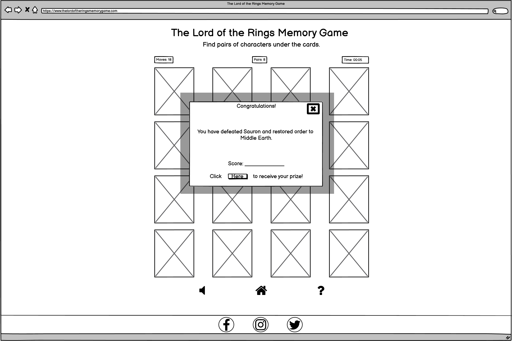
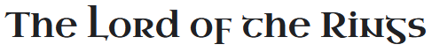
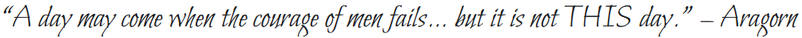

<h1 align="center">The Lord of the Rings Memory Game</h1>

*Created using* [Am I Responsive](http://ami.responsivedesign.is/)
 
The Lord of the Rings Memory Game is a themed card-matching game. The game objective is to find the matching pairs of cards 
within a minimum number of mouse clicks in a set timeframe. The game, while being fun to play, can also be used as a brain training tool to improve recall as well
as to improve hand-eye coordination and reaction times.

The game is geared towards fans of *The Lord of the Rings Trilogy* by J. R. R. Tolkien.  It incorportes 
The Lord of the Rings themed images, audio and facts with the intention of making the playing 
experience more enjoyable for the user.

The Lord of the Rings Memory Game website consists of one webpage and six modals created using [HTML5](http://en.wikipedia.org/wiki/HTML5), 
[CSS3](http://en.wikipedia.org/wiki/CSS), [JavaScript](https://en.wikipedia.org/wiki/JavaScript), 
the JavaScript library [jQuery](https://jquery.com/) and [The One API](https://the-one-api.dev/).  It was
created in order to fulfil the requirements of the Interactive Frontend Development Milestone Project 2, 
part of the Full Stack Web Development Program at the [Code Institue](https://codeinstitute.net/). 
The main requirements were to create a dynamic, interactive and responsive website that should provide relevant
responses to the users' actions. Users should be able to actively engage with the data, alter the way the site 
displays the information in order achieve their goals. 

Click <a href="https://nualagr.github.io/lotr/">here</a> to play the game online.
 

## **Table of Contents**
1. [**User Experience (UX)**](#ux)
    - [User Stories](#user-stories)
        - [New User](#new-user)
        - [General User](#general-user)
        - [The Lord of the Rings Fan](#the-lord-of-the-rings-fan)
        - [Site Owner](#site-owner)
2. [**User Centered Design**](#user-centered-design)
    - [1) The Strategy Plane](#1-strategy-plane)
    - [2) The Scope Plane](#2-scope-plane)
    - [3) The Structure Plane](#3-structure-plane)
         - [Features](#features)
    - [4) The Skeleton Plane](#4-skeleton-plane)
        - [Wireframes](#wireframes)
    - [5) The Surface Plane](#5-surface-plane) 
        - [Design](#design)
        - [Colour Scheme](#colour-scheme)
        - [Icons](#icons)
        - [Typography](#typography)
3. [**Development**](#development)
4. [**Technologies Used**](#technologies-used)
5. [**Testing**](#testing)
6. [**Deployment**](#deployment)
7. [**Credits**](#credits)
    - [Content](#content)
    - [Media](#media)
    - [Acknowledgements](#acknowledgements)
    - [References](#references)

 

---

## UX
*Use this section to provide insight into your UX process, focusing on who this website is for, what it is that they want to achieve and how your project is the best way to help them achieve these things.

In particular, as part of this section we recommend that you provide a list of User Stories, with the following general structure:

As a user type, I want to perform an action, so that I can achieve a goal.
This section is also where you would share links to any wireframes, mockups, diagrams etc. that you created as part of the design process. These files should themselves either be included as a pdf file in the 
project itself (in an separate directory), or just hosted elsewhere online and can be in any format that is viewable inside the browser.*
### User Stories

#### New User

As a new user I would like to be able to:

- play a card-matching game presented in a visually appealing format.
- play a game which increases in complexity/challenge.
- read the rules of the game.
- navigate through the site with ease.
- modify settings to suit my game-play requirements with regard to 
  - whether to play in-game audio
- receive regular, up-to-date feedback about how I am progressing in the game.
- enjoy the experience of playing the game.
- receive a visual reward for completing the game.
- learn some interesting facts about The Lord of the Rings characters.
- read some interesting quotes by the different Lord of the Rings characters.
- improve my congnitive function.
- improve my reaction times.

#### General User

As a returning user I would like to be able to:

- play a simple card-matching game presented in a visually appealing format.
- play a game which increases in complexity/challenge.
- be able to measure improving performance - feedback in the form of time taken and number of clicks displayed upon completion.
- receive different visual rewards for completing the game on subsequent attempts.
- view and match themed images of The Lord of the Rings characters.
- navigate through the site with ease.
- modify settings to suit my game-play requirements with regard to 
  - whether to play in-game audio.
- receive regular, up-to-date feedback about how I am progressing in the game.
- enjoy the experience of playing the game.
- be exposed to interesting facts about The Lord of the Rings characters.
- read some interesting quotes by The Lord of the Rings characters.
- improve my congnitive function.
- improve my reaction times.

#### The Lord of the Rings Fan

As a Lord of the Rings fan I would like to be able to:

- view and match themed images of The Lord of the Rings characters.
- enjoy the experience of playing the game.
- receive a visual reward for completing the game.
- be able to measure improving performance - feedback in the form of time taken and number of clicks displayed upon completion.
- be exposed to interesting facts about The Lord of the Rings characters.
- read some interesting quotes by The Lord of the Rings characters.

#### Site Owner
As the owner of The Lord of the Rings Memory Game site I would like:

- to be able to enjoy the experience of playing the game myself.
- to provide site users with an enjoyable playing experience.
- to provide site users with a visually appealing game. 
- to provide site users with a game that is intuitive to play.
- to provide site users with a game which increases in difficulty.
- to provide new users with game rules that are concise and easy to read. 
- to provide site users with feedback on their performance in order to encourage them to play again.
- to provide site users with a website that is easy to navigate.
- to provide site users with the ability to tailor their game experience by including the ability to turn the audio component off if desired. 
- to expose site users to interesting facts and quotes from The Lord of the Rings 
books with a view to sharing my love of the Trilogy and instilling a curiosity in those who 
have not yet read the books. 

 

##### back to [top](#table-of-contents)
---

## User Centered Design
### 1 Strategy Plane
The User Centered Design process started with the creation of the User Stories.  These influenced subsequent feature, layout and design decisions.

The main  goal of the website is to provide users with an engaging game. 
The perceived audience of this site are fans of The Lord of the Rings Trilogy, teenagers and younger children who want to play a fun game or compete against 
each other or people who want to improve their memory and/or reaction times.

The site has been designed to provide minimal, but relevant, content that is easy to comprehend and that satisfies the needs of both the users and the site owner. 

 

##### back to [top](#table-of-contents)
---

### 2 Scope Plane
The key features of the website were developed based on the user needs. 

Users should be able to do the following on the website:
- Read the rules of the game
- Start a game
- Mute the sound effects
- Turn over two cards at a time
- Match cards
- See their score at the end
- See how much time is left in the current level
- Advance to levels of increasing difficulty
- Read interesting facts about *The Lord of the Rings* characters.
- Easily access dedicated *The Lord of the Rings* social media channels.

 

##### back to [top](#table-of-contents)
---

### 3 Structure Plane

After identifying the needs of the site's users and after visiting pairs card matching websites the following website design and features were chosen

For ease of navigation it was decided to opt for a single page with pop-up modals 
- to start the game
- to provide a failure to proceed message
- to show a 'proceed to the next level' message
- to congratulate winners and show them their score
- to provide the user with the rules of the game
- to provide winners with a visual prize modal which displays character information.

 

### Features
*In this section, you should go over the different parts of your project, and describe each in a sentence or so.*

The game is designed to be as intuitive as possible.

### Existing Features
*Feature 1 - allows users X to achieve Y, by having them fill out Z*

*For some/all of your features, you may choose to reference the specific project files that implement them, 
although this is entirely optional.*

A ring **favicon**, displayed on the web brower's tab, allows the user to identify the website by sight.

The **Title**, displayed on the web browser's tab at all times, clearly identifies the site as a *Lord of the Rings* themed memory game.

**Opening Modal** - Outlines the rules of the game and explains what is needed in order to advance to the next level.

**Playing Cards** - The playing cards, 8 (round one), 12 (round two) or 16 (round three) are displayed face down in a grid formation.  A uniform
back-of-card image makes it obvious to the user that the cards are face down.

The Lord of the Rings **themed character images** created in [SP-Studio](https://www.sp-studio.de/) are displayed once the card is clicked.
They provide the user with visually pleasing and easily differentiated images to match.

**Sound effects** - provide aural feedback to the user 
- when the game starts, 
- when they click on a card, 
- when a match is successful, 
- when a match is not successful and 
- when the game is over.

**Pairs Counter** - provides the user with a visual score of the number of pairs they have matched within a given round.

**Clicks Counter** - provides the user with a visual score of the number of clicks they have used so far within a given round.

**Count Down Timer** - provides the user with a visual representation of the game-play time left in the current round.

**Mute sound effects button** - allows the user to turn off in-game sound effects.

**Home button** - allows the user to navigate back to the home page and restart their game experience.

**Help button** - brings up a modal of the game rules.

**Failure Modal** - alerts the user to the fact that they did no complete the round in the given timeframe.  A **Restart** button allows them to start a new game immediately.

**Completion Modal** - pop up window congratulates the user at the end of Round Three and provides them with their **Score** (calculated by adding the seconds unused to the number of clicks left out of 100) and provides them with a **Prize Button** which opens a visual prize modal.

**Character Information Modal** - Modal which contains a random character image and information (name, species, place of birth, etc.) and a quote from the character.

A **footer** contains **social media** links to:

- the official [Facebook](https://www.facebook.com/lordoftheringsbook/) page for The Lord of the Rings Books.
- The Lord of the Rings [Twitter](https://twitter.com/lotr) page.
- a Lord of the Rings [Istagram](https://www.instagram.com/lordoftherings_official/?hl=en) fan page.

  

### Features Left to Implement
**Further levels** of increasing difficulty.

A **highest score board** would allow players to compete with other users in an asynchronous fashion.

A **themed playing environment**. Expand the range of characters and allow users to choose whether to play for Sauron or The Fellowship. Change the font, colour-scheme and music accordingly. 

 

##### back to [top](#table-of-contents)
---

### 4 Skeleton Plane

The UI wireframing tool, [Balsamiq](https://balsamiq.com/), was used to create wireframes for each site page as it would appear on desktop, tablet and mobile devices.

The main content area was expressed similarly on each of the three levels to create consistency across the game as a whole.  

In Round One 8 of the 16 divs on the page display cards.

In Round Two 12 of the 16 divs on the page display cards.

In Round Three all 16 divs are displayed on the page.

A Moves Counter is visible above the top right-hand corner of the card-deck area displaying the number of moves taken so far.

A Pairs Counter is visible above the card-deck-area showing the number of pairs successfully matched so far.

A Count Down Timer is visible above the left-hand corner of the card-deck area displaying the number of seconds left to complete the current round.

A footer, which contains links to Lord of the Rings social media sites was included at the bottom of every page.

 

#### Wireframes

##### Desktop
- [Desktop Opening Modal](https://github.com/nualagr/the-lord-of-the-rings-game/blob/master/documentation/wireframes/desktop-opening-modal.png)

- [Desktop Round One with Advance to Level 2 Modal](https://github.com/nualagr/the-lord-of-the-rings-game/blob/master/documentation/wireframes/desktop-round-one-with-modal.png)

- [Desktop Round Two with Failure Modal](https://github.com/nualagr/the-lord-of-the-rings-game/blob/master/documentation/wireframes/desktop-round-two-with-modal.png)

- [Desktop Round Three with Winning Modal](https://github.com/nualagr/the-lord-of-the-rings-game/blob/master/documentation/wireframes/desktop-round-three-with-modal.png)

- [Desktop Prize Modal](https://github.com/nualagr/the-lord-of-the-rings-game/blob/master/documentation/wireframes/prize.png)

##### Tablet
- [Tablet Round One](https://github.com/nualagr/the-lord-of-the-rings-game/blob/master/documentation/wireframes/ipad-round-one.png)

- [Tablet Round Two](https://github.com/nualagr/the-lord-of-the-rings-game/blob/master/documentation/wireframes/ipad-round-two.png)

- [Tablet Round Three](https://github.com/nualagr/the-lord-of-the-rings-game/blob/master/documentation/wireframes/ipad-round-three.png)

##### Mobile
- [Mobile Round One](https://github.com/nualagr/the-lord-of-the-rings-game/blob/master/documentation/wireframes/phone-round-one.png)

- [Mobile Round Two](https://github.com/nualagr/the-lord-of-the-rings-game/blob/master/documentation/wireframes/phone-round-one.png)

- [Mobile Round Three](https://github.com/nualagr/the-lord-of-the-rings-game/blob/master/documentation/wireframes/phone-round-one.png)

 

##### back to [top](#table-of-contents)
---

### 5 Surface Plane

#### Design

#### Colour Scheme

 

The colour scheme was chosen by uploading The Lord of the Rings film poster to 
[coolors.co](https://coolors.co/ffbe0b-fb5607-ff006e-8338ec-3a86ff).  Using the colour picker
 the hexidecimal equivalent of the prevailing colours used within the poster were identified. 

 

*Colour palette created at* [coolors.co](https://coolors.co/ffbe0b-fb5607-ff006e-8338ec-3a86ff).

#### Cards
[SP-Studio](https://www.sp-studio.de/) was used to create the Lord of the Rings themed character images.

#### Icons
Icons were used alongside the text within the site in order to help the user to understand the content at a glance. 
They were taken from [Font Awesome](https://fontawesome.com/) and chosen to be self explanatory, for example the image of 
a house was chosen for the Home button.

#### Typography
*Uncial Antiqua* was chosen as the main heading font.  
 

The complimentary font *Roboto Slab*, which was recommended by [Google Fonts](https://fonts.google.com/), 
was chosen for the text used within the body of the site.  

*Bilbo*, a legible calligraphic style, was chosen for the quotes from the book that are displayed upon completion of the level.

 

##### back to [top](#table-of-contents)
---

## Technologies Used
*In this section, you should mention all of the languages, frameworks, libraries, and any other tools that you have used to construct this project. 
For each, provide its name, a link to its official site and a short sentence of why it was used.*

- Languages: 

  * [HTML5](http://en.wikipedia.org/wiki/HTML5). Used to create the structure of the website.
  * [CSS3](http://en.wikipedia.org/wiki/CSS). Used to style the site. 
  * [JavaScript](https://en.wikipedia.org/wiki/JavaScript). Used to create the dynamic, interactive elements of the website.

- Websites
  * [Am I Responsive](http://ami.responsivedesign.is/). Used to create the mock-up image at the top of this document which shows the site as it would behave when viewed on desktop, mobile and tablet devices. 
  * [Code Institute](https://codeinstitute.net/). Used to review concepts covered in preceding modules and walk-through projects. 
  * [Coolors](https://coolors.co/ffbe0b-fb5607-ff006e-8338ec-3a86ff). Used to choose a colour scheme.
  * [Font Awesome](https://fontawesome.com/). Used to source the free icons that were used for the social media links in the footer and for the mute icon.
  * [Font Squirrel](https://www.fontsquirrel.com/tools/webfont-generator). Used to create the Web Font Kit for the Ringbearer font.
  * [Google Chrome Developer Tools](https://developers.google.com/web/tools/chrome-devtools). Used extensively throughout the project to test the responsiveness of elements, to target and apply CSS styles during the design phase and to test the site's performance once built. 
  * [Google Fonts](https://fonts.google.com/). Used to choose and source the fonts used throughout the site.
  * [Github](https://github.com/). Used to host the deployed site and used as a respository for all previous versions of the build.
  * [Gitpod](https://www.gitpod.io/). Online IDE used to build and develop the website.
  * [jQuery](https://jquery.com/). The JavaScript library was used to traverse the DOM tree, event handling and CSS animation.
  * [Optimizilla](https://imagecompressor.com/). Used during the testing phase in order to compress the photographs to reduce the site loading time.
  * [Slack](code-institute-room.slack.com). Used during all phases of development and testing to find the answers to questions and the solutions to problems enountered.
  * [SP-Studio](https://www.sp-studio.de/).  Used to create the Lord of the Rings themed character images.
  * [Stack Overflow](https://stackoverflow.com/). Used to search for the answers to problems encountered during the development and testing of the website.
  * [Vectorstock](https://www.vectorstock.com/). Used to source the White Tree of Gondor image used for the back of the game cards.
  * [W3C CSS Validation Service](https://jigsaw.w3.org/css-validator/validator). Used to validate the CSS file.
  * [W3C HTML Validation Service](https://validator.w3.org/#validate_by_uri). Used to validate the HTML files.

- Frameworks
  * [Bootstrap Framework](https://getbootstrap.com/). Used to structure the website layout and ensure that it was responsive on all devices.
  * [Jasmine](https://en.wikipedia.org/wiki/Jasmine_(JavaScript_testing_framework)). JavaScript testing framework used to create the testing suite.

- APIs
  * [The Lord of the Rings API](https://the-one-api.dev/). Used to source the character information and quotes displayed during game play.

- Apps:
  * [Balsamiq](https://balsamiq.com/). Used to create the project wireframes.
  * [Inkscape](https://inkscape.org/). Used to edit the FontAwesome ring icons that was used as the Favicon.

##### back to [top](#table-of-contents)
---

## JQuery
The project uses JQuery to simplify DOM manipulation.
## Testing
In this section, you need to convince the assessor that you have conducted enough testing to legitimately believe that the site works well. Essentially, in this part you will want to go over all of your user stories from the UX section and ensure that they all work as intended, with the project providing an easy and straightforward way for the users to achieve their goals.

Whenever it is feasible, prefer to automate your tests, and if you've done so, provide a brief explanation of your approach, link to the test file(s) and explain how to run them.

For any scenarios that have not been automated, test the user stories manually and provide as much detail as is relevant. A particularly useful form for describing your testing process is via scenarios, such as:

Contact form:
Go to the "Contact Us" page
Try to submit the empty form and verify that an error message about the required fields appears
Try to submit the form with an invalid email address and verify that a relevant error message appears
Try to submit the form with all inputs valid and verify that a success message appears.
In addition, you should mention in this section how your project looks and works on different browsers and screen sizes.

### Bugs
You should also mention in this section any interesting bugs or problems you discovered during your testing, even if you haven't addressed them yet.
If this section grows too long, you may want to split it off into a separate file and link to it from here.

##### back to [top](#table-of-contents)
---

## Deployment

This project is hosted on [GitHub Pages](https://pages.github.com/)

### Deployment Procedure Followed:

1) When logged in to the [Github](https://github.com/) website the *The Lord of the Rings Memory Game* repository was selected from the repositories list in the top left-hand corner of the screen.

2) When in the selected respository, **Settings** was chosen from the navigation bar below the repository title.

3) Scrolling down the **Settings** page revealed the **GitHub Pages** heading.  Under the **Source** subheading, the dropdown menu, whose default value is 'None', was clicked.  'Master' was selected from the dropdown list.

4) The **Save** button to the right of the newly selected 'Branch: master' was then clicked to deploy the site.

 

### To find the link to the newly deployed site:

1) When logged in to the [Github](https://github.com/) website, navigate to the desired repository.

2) In the navigation pane on the right of the screen, under the heading **Environments** click on the 'github-pages' link.

3) Under the heading **Deployments/Activity Log** click on the 'View deployment' button to the right of the screen. 
The website will open in a separate browser window.

 

### To clone the repository:

1) Log in to [Github](https://github.com/).

2) Navigate to the main page of the repository.

3) Select the green **Code** button from the navigation bar below the repository title.

4) Under the heading **Clone** select 'HTTPS'

5) Click the image of a clipboard to the right of the URL in order to copy the address. 

6) Open Git Bash.

7) Navigate to the desired directory in which you wish to place the cloned directory.

8) Type git clone, space, and then paste the copied URL.  

9) Press 'Enter' to create the clone.

This section should describe the process you went through to deploy the project to a hosting platform (e.g. GitHub Pages or Heroku).

In particular, you should provide all details of the differences between the deployed version and the development version, if any, including:

Different values for environment variables (Heroku Config Vars)?
Different configuration files?
Separate git branch?
In addition, if it is not obvious, you should also describe how to run your code locally.

##### back to [top](#table-of-contents)
---

## Credits
### Content
*The text for section Y was copied from the Wikipedia article Z*
### Media
*The photos used in this site were obtained from ...*

Font Awesome icons used: 
<i class="fas fa-ring"></i>

<i class="fas fa-volume-mute"></i>

<i class="fas fa-volume-up"></i>

<i class="fas fa-question"></i>

<i class="fab fa-facebook-f"></i>

<i class="fab fa-instagram"></i>

<i class="fab fa-twitter"></i>

<i class="fas fa-home"></i>

<i class="far fa-times-circle"></i>

<i class="far fa-check-circle"></i>

<i class="far fa-thumbs-up"></i>

### Images
- Forest background from [https://www.vecteezy.com/](https://www.vecteezy.com/vector-art/224401-vector-cartoon-landscape-illustration).

- Mountain and river background from [https://www.vecteezy.com/](https://www.vecteezy.com/vector-art/171288-free-hand-drawn-vector-landscape-illustration).

- Grey foret and mountian [Vecteezy](https://www.vecteezy.com/vector-art/229817-vector-beautiful-landscape-illustration)

- A flat natural landscape [Vecteezy](https://www.vecteezy.com/vector-art/296664-a-flat-nature-landscape)

- Nature scene with dark sky over volcano [Vecteezy](https://www.vecteezy.com/vector-art/669093-nature-scene-with-dark-sky-over-volcano)

- Path through fields[Vecteezy](https://www.vecteezy.com/vector-art/303633-nature-hill-landscape-vector)

- Hot desert landscape[Vecteezy](https://www.vecteezy.com/vector-art/300455-a-hot-desert-landscape)

- Unique Martian landscape[Vecteezy](https://www.vecteezy.com/vector-art/187145-unique-martian-landscape-vectors)

- Stones, river, trees, mountains[Vecteezy](https://www.vecteezy.com/vector-art/297137-a-nature-green-landscape)

- White Tree of Gondor [Vectorstock](https://www.vectorstock.com/royalty-free-vector/white-tree-gondor-isolated-black-and-white-eps-vector-27150646)
 

##### back to [top](#table-of-contents)
---

### Acknowledgements
- [Code Institue](https://codeinstitute.net/) and the very helpful tutors.
- A special thank you to my project mentor [Reuben Ferrante](https://uk.linkedin.com/in/reuben-ferrante) for his wisdom and guidance during the project. 
- The [Code Institue](https://codeinstitute.net/) community on [Slack](code-institute-room.slack.com) for their support.
- I received inspiration for this project from:
  - https://zahur76.github.io/MilestoneProject2/
  - https://nickbell123.github.io/Marvel-Memory-Game/
  - [8-bitEarth](https://www.deviantart.com/8-bitearth/art/The-Lord-of-the-Rings-South-Park-version-363629107)'s Lord of the Rings character images created using [SP-Studio](https://www.sp-studio.de/).

 

##### back to [top](#table-of-contents)
---
