<h1 align="center">The Lord of the Rings Memory Game</h1>

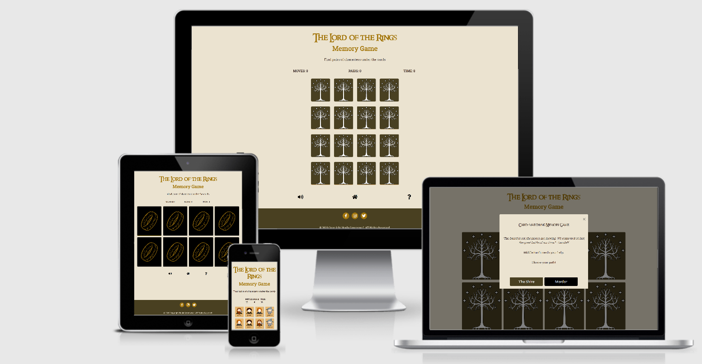
*Created using* [Am I Responsive](http://ami.responsivedesign.is/)
 

The Lord of the Rings Memory Game is a themed card-matching game. The game objective is to find the matching pairs of cards 
within a minimum number of mouse clicks in a set timeframe. The game, while being fun to play, can also be used as a brain training tool to improve recall as well
as to improve hand-eye coordination and reaction times.

The game is geared towards fans of *The Lord of the Rings Trilogy* by J. R. R. Tolkien.  It incorportes 
*The Lord of the Rings* themed images and facts with the intention of making the playing 
experience more enjoyable for the user.

The Lord of the Rings Memory Game website consists of one webpage and seven modals created using [HTML5](http://en.wikipedia.org/wiki/HTML5), 
[CSS3](http://en.wikipedia.org/wiki/CSS), [JavaScript](https://en.wikipedia.org/wiki/JavaScript), 
the JavaScript library [jQuery](https://jquery.com/) and [The One API](https://the-one-api.dev/).  It was
created in order to fulfil the requirements of the Interactive Frontend Development Milestone Project 2, 
part of the Full Stack Web Development Program at the [Code Institue](https://codeinstitute.net/). 
The main requirements were to create a dynamic, interactive and responsive website that provides relevant
responses to the users' actions. Users should be able to actively engage with the data and alter the way the site 
displays the information in order achieve their goals. 

Click <a href="https://nualagr.github.io/the-lord-of-the-rings-game/">here</a> to play the game online.
 

## **Table of Contents**
1. [**User Experience (UX)**](#ux)
    - [User Stories](#user-stories)
        - [New User](#new-user)
        - [General User](#general-user)
        - [The Lord of the Rings Fan](#the-lord-of-the-rings-fan)
        - [Site Owner](#site-owner)
2. [**User Centered Design**](#user-centered-design)
    - [1) The Strategy Plane](#1-strategy-plane)
    - [2) The Scope Plane](#2-scope-plane)
    - [3) The Structure Plane](#3-structure-plane)
         - [Features](#features)
    - [4) The Skeleton Plane](#4-skeleton-plane)
        - [Wireframes](#wireframes)
    - [5) The Surface Plane](#5-surface-plane) 
        - [Design](#design)
        - [Colour Scheme](#colour-scheme)
        - [Icons](#icons)
        - [Typography](#typography)
3. [**Development**](#development)
4. [**Technologies Used**](#technologies-used)
5. [**Testing**](#testing)
    - [Performance](#performance)
    - [Responsiveness](#responsiveness)
    - [Tested User Stories](#tested-user-stories)
    - [Bugs](#bugs)
6. [**Deployment**](#deployment)
7. [**Credits**](#credits)
    - [Content](#content)
    - [Media](#media)
    - [Acknowledgements](#acknowledgements)

 

---

## UX

### User Stories

#### New User

As a new user I would like to be able to:

- play a card-matching game presented in a visually appealing format.
- play a game which increases in complexity/challenge.
- read the rules of the game.
- navigate through the site with ease.
- modify settings to suit my game-play requirements with regard to 
  - whether to play in-game audio
  - whether to play with the Fellowship Card Pack or the Mordor Card Pack.
- receive regular, up-to-date feedback about how I am progressing in the game.
- enjoy the experience of playing the game.
- receive a visual reward for completing the game.
- learn some interesting facts about The Lord of the Rings characters.
- read some interesting quotes by the different Lord of the Rings characters.
- improve my cognitive function.
- improve my reaction times.

#### General User

As a returning user I would like to be able to:

- play a simple card-matching game presented in a visually appealing format.
- play a game which increases in complexity/challenge.
- receive different visual rewards for completing the game on subsequent attempts.
- view and match themed images of *The Lord of the Rings* characters.
- navigate through the site with ease.
- modify settings to suit my game-play requirements with regard to 
  - whether I want in-game sound effects
  - whether I want to play with the Fellowship Card Pack or the Mordor Card Pack.
- receive regular, up-to-date feedback about how I am progressing in the game.
- enjoy the experience of playing the game.
- be exposed to interesting facts about *The Lord of the Rings* characters.
- read some interesting quotes by *The Lord of the Rings* characters.
- improve my cognitive function.
- improve my reaction times.

#### The Lord of the Rings Fan

As a Lord of the Rings fan I would like to be able to:

- view and match themed images of *The Lord of the Rings* characters.
- enjoy the experience of playing the game.
- receive a visual reward for completing the game.
- be exposed to interesting facts about different Lord of the Rings characters.
- read some interesting quotes by *The Lord of the Rings* characters.

#### Site Owner
As the owner of The Lord of the Rings Memory Game site I would like:

- to be able to enjoy the experience of playing the game myself.
- to provide site users with an enjoyable playing experience.
- to provide site users with a visually appealing game. 
- to provide site users with a game that is intuitive to play.
- to provide site users with a game which increases in difficulty.
- to provide new users with game rules that are concise and easy to read. 
- to provide site users with a website that is easy to navigate.
- to provide site users with the ability to tailor their game experience by including the ability to turn the audio component off if desired
and to choose to play with either the Fellowship Card Pack or the Mordor Card Pack. 
- to expose site users to interesting facts and quotes from *The Lord of the Rings* 
books with a view to sharing my love of the trilogy and instilling a curiosity in those who 
have not yet read the books. 
- to provide users with links to other websites, social media sites and *The One Wiki to Rule them All* where they can access further information
about *The Lord of the Rings* trilogy and connect with other fans of the books and films.

 

##### back to [top](#table-of-contents)
---

## User Centered Design
### 1 Strategy Plane
The User Centered Design process started with the creation of the User Stories.  These influenced subsequent feature, layout and design decisions.

The main  goal of the website is to provide users with an engaging game. 
The perceived audience of this site are fans of *The Lord of the Rings Trilogy*, teenagers and younger children who want to play a fun game or compete against 
each other or people who want to improve their memory and/or reaction times.

The site has been designed to provide minimal, but relevant, content that is easy to comprehend and that satisfies the needs of both the users and the site owner. 

 

##### back to [top](#table-of-contents)
---

### 2 Scope Plane
The key features of the website were developed based on the user needs. 

Users should be able to do the following on the website:
- Choose a card pack
- Start a game
- Read the rules of the game
- Mute the sound effects
- Turn over two cards at a time
- Match cards
- See how much time is left in the current level
- Advance to levels of increasing difficulty
- Read interesting facts about *The Lord of the Rings* characters
- Easily access dedicated *The Lord of the Rings* social media channels

 

##### back to [top](#table-of-contents)
---

### 3 Structure Plane

After identifying the needs of the site's users and after visiting pairs card matching websites the following website design and features were chosen

For ease of navigation it was decided to opt for a single page with pop-up modals 
- to start the game
- to provide the user with the rules of the game
- to provide a 'game over' message when the user runs out of time
- to show an 'advance to the next level' message for each round
- to congratulate winners
- to provide winners with a visual prize modal which displays character information.

 

### Features

The game is designed to be as intuitive as possible.

### Existing Features

A ring **favicon**, displayed on the web brower's tab, allows the user to identify the website by sight.

The **Title**, displayed on the web browser's tab at all times, clearly identifies the site as a *Lord of the Rings* themed memory game.

**Opening Modal** - Provides the user with a choice of themed playing cards.

**Playing Cards** - The playing cards, 8 (round one), 12 (round two) or 16 (round three) are displayed face down in a grid formation.  A uniform
back-of-card image makes it obvious to the user that the cards are face down.

*The Lord of the Rings* **themed character images** created in [SP-Studio](https://www.sp-studio.de/) are displayed once the card is clicked.
They provide the user with visually pleasing and easily differentiated images to match.

**Sound effects** - provide aural feedback to the user 
- when the game starts, 
- when they click on a card, 
- when a match is successful, 
- when a match is not successful and the cards flip back over,
- when a level has successfully been completed,
- when the player has successfully completed the game,
- if the player runs out of time and the game is over.  

**Instructive subheading**  - located above the game board, this line succinctly explains the aim of the game to the user, "Find pairs of characters under the cards".

**Pairs Counter** - provides the user with a visual score of the number of pairs they have matched within a given round.

**Moves Counter** - provides the user with a visual score of the number of clicks they have used so far within a given round.

**Count Down Timer** - provides the user with a visual representation of the game-play time remaining in the current round.

**Mute sound effects button** - allows the user to turn off in-game sound effects.

**Home button** - allows the user to navigate back to the home page and restart their game experience.

**Help button** - brings up a modal of the game rules.

**Game Over Modal** - alerts the user to the fact that they did not complete the round in the given timeframe.  A **Restart** button allows them to start a new game immediately.

**Completion Modal** - pop up window congratulates the user at the end of Round Three and provides them with a **Prize Button** which opens a visual prize modal.

**Character Information Modal** - This modal, the visual prize, is populated with information regarding the last card matched in the game.  
It contains the in-game character image and information (gender, place of birth, etc.) drawn from *The One API*.

A **footer** contains **social media** links to:

- the official [Facebook](https://www.facebook.com/lordoftheringsbook/) page for *The Lord of the Rings* Books.
- *The Lord of the Rings* [Twitter](https://twitter.com/lotr) page.
- a Lord of the Rings [Istagram](https://www.instagram.com/lordoftherings_official/?hl=en) fan page.

  

### Features Left to Implement
**Further levels** of increasing difficulty.

A **highest score board** would allow players to compete with other users in an asynchronous fashion.

A **themed playing environment**. It is envisaged that the range of characters will be expanded and that
the different pack choices would result in differing fonts, colour-shcemes and in-game background music accordingly. 

 

##### back to [top](#table-of-contents)
---

### 4 Skeleton Plane

The UI wireframing tool, [Balsamiq](https://balsamiq.com/), was used to create wireframes for each site page as it would appear on desktop, tablet and mobile devices.

The main content area was expressed similarly on each of the three levels to create consistency across the game as a whole.  

In Round One 8 of the 16 divs on the page display cards.

In Round Two 12 of the 16 divs on the page display cards.

In Round Three all 16 divs are displayed on the page.

A Moves Counter is visible above the top right-hand corner of the card-deck area displaying the number of moves taken so far.

A Pairs Counter is visible above the card-deck-area showing the number of pairs successfully matched so far.

A Count Down Timer is visible above the left-hand corner of the card-deck area displaying the number of seconds left to complete the current round.

The Mute button, Home button and Help button, expressed visually using intuitive icons, are centrally aligned under the playing cards in each round.

A footer, which contains links to Lord of the Rings social media sites was included at the bottom of every page.

 

#### Wireframes

##### Desktop
- [Desktop Opening Modal](https://github.com/nualagr/the-lord-of-the-rings-game/blob/master/documentation/wireframes/desktop-opening-modal.png)

- [Desktop Round One with Advance to Level 2 Modal](https://github.com/nualagr/the-lord-of-the-rings-game/blob/master/documentation/wireframes/desktop-round-one-with-modal.png)

- [Desktop Round Two with Game Over Modal](https://github.com/nualagr/the-lord-of-the-rings-game/blob/master/documentation/wireframes/desktop-round-two-with-modal.png)

- [Desktop Round Three with Winning Modal](https://github.com/nualagr/the-lord-of-the-rings-game/blob/master/documentation/wireframes/desktop-round-three-with-modal.png)

- [Desktop Prize Modal](https://github.com/nualagr/the-lord-of-the-rings-game/blob/master/documentation/wireframes/prize.png)

##### Tablet
- [Tablet Round One](https://github.com/nualagr/the-lord-of-the-rings-game/blob/master/documentation/wireframes/ipad-round-one.png)

- [Tablet Round Two](https://github.com/nualagr/the-lord-of-the-rings-game/blob/master/documentation/wireframes/ipad-round-two.png)

- [Tablet Round Three](https://github.com/nualagr/the-lord-of-the-rings-game/blob/master/documentation/wireframes/ipad-round-three.png)

##### Mobile
- [Mobile Round One](https://github.com/nualagr/the-lord-of-the-rings-game/blob/master/documentation/wireframes/phone-round-one.png)

- [Mobile Round Two](https://github.com/nualagr/the-lord-of-the-rings-game/blob/master/documentation/wireframes/phone-round-one.png)

- [Mobile Round Three](https://github.com/nualagr/the-lord-of-the-rings-game/blob/master/documentation/wireframes/phone-round-one.png)

 

##### back to [top](#table-of-contents)
---

### 5 Surface Plane

#### Design

#### Colour Scheme

 

The initial colour scheme was chosen by uploading The Lord of the Rings film poster to 
[coolors.co](https://coolors.co/ffbe0b-fb5607-ff006e-8338ec-3a86ff).  Using the colour picker
 the hexidecimal equivalent of the prevailing colours used within the poster were identified. 

 

During development it became necessary to expand the colour palette in order to provide visual contrast when the Mordor themed playing cards were chosen.
*Bistre Brown*, #8B720E with white text was chosen for the Mordor playing cards when face up and black and gold were chosen for the back of the card design.

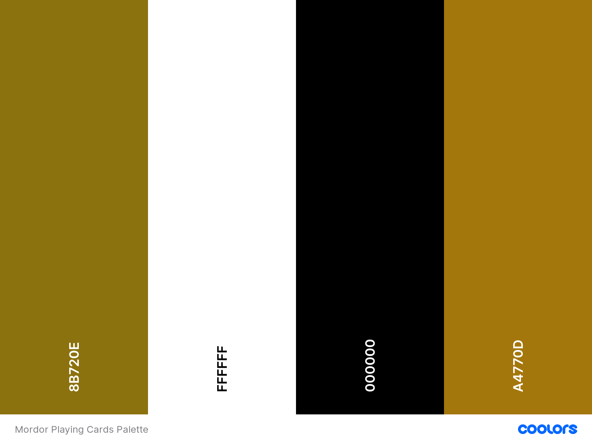

#### Cards
[SP-Studio](https://www.sp-studio.de/) was used to create *The Lord of the Rings* themed character images.

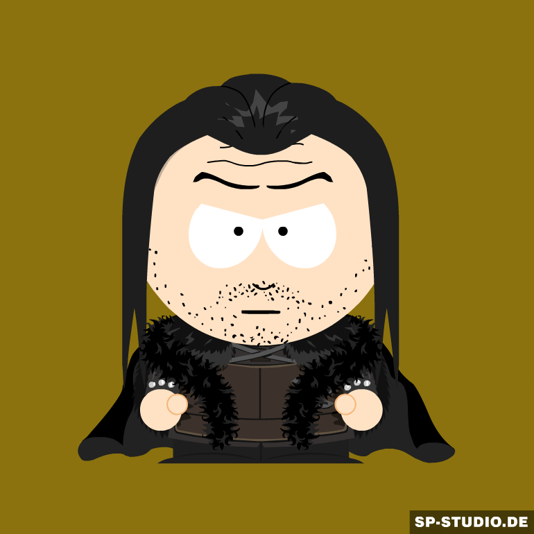

#### Icons
Icons were used as buttons on the main game page in order to help the user to understand the buttons' functions at a glance. 
They were taken from [Font Awesome](https://fontawesome.com/) and chosen to be self explanatory, for example the image of 
a house was chosen for the Home button.

 

##### back to [top](#table-of-contents)
---

#### Typography
*Uncial Antiqua* was initially chosen as the main heading font.  
 

The complimentary font *Roboto Slab*, which was recommended by [Google Fonts](https://fonts.google.com/), 
was chosen for the text used within the body of the site.  

When it came to creating the playing cards it was decided that a fan-made version of the actual font used for the Lord of the Rings film titles, *Ringbearer Medium* designed by Peter Klassen, was to be used for 
the character names on the cards.  

Therefore in order to create visual unity that font was also used for titles within the site instead of *Uncial Antiqua*.  The font file was uploaded 
to [Font Squirrel](https://www.fontsquirrel.com/tools/webfont-generator)'s webfont generator and the webfont styles were stored in the assets folder along with the 'style.css' file. 

 

The *one-ring-font* by [Gaut Fonts](https://www.fontspace.com/gaut-fonts) was used to create the ring design on the back of the Mordor Card Pack cards.

 

##### back to [top](#table-of-contents)
---

## Development

During the first mentor session it became apparent that the wireframes and the project proposal did not fulfil the Milestone 2 project specification
with regard to giving the user power to alter the way the site displays information. Therefore it was decided to add a second pack of
playing cards and allow the user to choose between the Fellowship characters or the Mordor characters when playing the game.

The 'index.html' file and accompanying 'style.css' files were created first to provide the game structure and general appearance.
The [Bootstrap](https://getbootstrap.com/docs/4.0/layout/grid/) grid was used to create the game board so that it would respond automatically to the 
differing viewing device dimensions.  [Google Chrome Developer Tools](https://developers.google.com/web/tools/chrome-devtools) 
were used throughout the development process to test how elements responded when viewed on mobile and/or tablet devices. 
When design issues were encountered the Device Selector was used to target the element in question. 
Using the Elements Panel within the Developer Tools the code was altered and working code snippets were then replicated in the 'style.css' file in Gitpod. 
Solutions for other issues were found in the [Code Institute Slack channels](https://app.slack.com/client/T0L30B202/C7HD37Q1F/thread/C7J2ZAVHB-1602265383.366600), 
on [Stack Overflow](https://stackoverflow.com/) and on [W3Schools](https://www.w3schools.com/).

When it came to the interactive aspect of the project my mentor, Mr. [Reuben Ferrante](https://uk.linkedin.com/in/reuben-ferrante), suggested starting with the logic regarding the addition of extra rows 
of cards with the progression of each round.  As this is a single-page site and the opening modal does not obscure the page behind, the initial two rows of 
four cards are created in the HTML page.  The addition of the next row of cards is created in the 'script.js' file by cloning row 2 of the initial board. 
A class of 'extra-row' is added to this new row in order to allow for easy deletion if the player runs out of time or presses the Restart button.

**Game Logic**

When the player makes their initial choice of card pack the button calls the *startGame* function.  This in turn sets 
up the game by creating a new Audio Controller, Moves Counter, Pairs Counter and passing these variables, as well as 
the chosenCardList to other functions such as the *setUpAdvanceLevel* function, the *setUpRestart* function and the
*assignCards* function.

The *assignCards* function calls the *makeDeck* function which creates a smaller array of cards from the full deck.  
It's length is calculated by halving the number of divs to be filled. 
The *makeDeck* function uses the *Card* class to create a pair of each cards with differing ids, so that they can be differentiated later and cannot be matched with themselves.  
The *shuffle* function is called to randomize the order of the cards. The *assignCards* function then continues and assigns the cards to the empty divs.

The countdown clock starts immediately when the the cards have been assigned.  

When the user clicks on a div an *if* statement checks whether *isProcessing* is false.  
This is to ensure that two cards have not already been turned up and are in the process of being compared.  
If *isProcessing* is false the function continues.
The class of 'unmatched' is removed from the div in order to remove the event listener and prevent the card from responding to a further click.
The front of the card image is revealed to the user and a 'flip' sound effect is played to give the user auditory feedback.  
The *incrementMoves* method adds one to the Moves Counter. 
If the *checkArray* global variable is an empty array then the card is the first to be clicked and is added to that array.  

If the array has a card in it then the cards are compared using the card 'name' and 'id'.  

If the cards match, the *incrementPairs* method increases the Pairs Counter by one and the *incrementMoves* method increases the Moves Counter by one. 
A 'bell chime' sound indicates to the user that a successful match has been made. 
The matching cards are left face-up, the class of 'matched' is applied to the divs, which removes the click functionality from the divs.  
At this point, *if* and *else if* statements check whether the round is complete and whether the game is over and turn on the corresponding modals accordingly.
If the round or game is not over the *checkArray* is emptied and the game continues.

If the cards do not match the *incrementMoves* method adds one to the Moves Counter. 
The *checkArray* is cleared, the 'face-up' class is removed from the divs and an 'unflip' sound is played.            
A one second delay was applied to the comparison through the use of a *setTimeout* function so that the second card face would be revealed to the user before being placed back in a face-down position.

**API Call**

If the user successfully completes the game in the allotted timeframe the *Congratulations* modal appears and the 'winner.mp3' sound is played.
At this point the API call is made and the relevant information relating to the character on the final card that was matched is written to the *Prize Modal*.
If the XMLHttpRequest is not successful the error message is written to the *Prize Modal*.
The *Congratulations Modal* contains the button which calls the *Prize Modal*.
Once opened the user is presented with the final character's in-game image along with information ranging from the character's height, race, gender, birth, spouse, death, 
realm, hair-colour and a link to their dedicated page on *The One Wiki to Rule them All*, if one exists.
As this information varies from character to character the *removeIfBlank* function within the *getData* function removes any key value pairs that contain an empty string or 'NaN'.
The user is presented only with the entries that contain data.

**Refactoring**

Refactoring of the code happened throughout the development process.  

Notable improvements include the use of classes for the creation of the Cards, the Audio Controller,
the Moves Counter, the Pairs Counter and the Timer.

During Mentor Session 2 it was recommended that the JavaScript code be split into four separate files in order to make the code easier to work with and to manage.
The code was separated into: 'constants.js', 'classes.js', 'helpers.js' and 'script.js'.  However, when it came to the final linter test the code was again
amalgamated into 'script.js'.  

The final refactoring consisted of removing the need for some of the global variables by creating the Timer, Audio Controller, Moves Counter and Pairs Counter
within a new *startGame* function.  This function then called other functions, such as the *assignCards* function and passed the timer, the other counters and the chosenCardPack
to these functions as variables. 
 
 

##### back to [top](#table-of-contents)
---

## Technologies Used

- Languages: 

  * [HTML5](http://en.wikipedia.org/wiki/HTML5). Used to create the structure of the website.
  * [CSS3](http://en.wikipedia.org/wiki/CSS). Used to style the site. 
  * [JavaScript](https://en.wikipedia.org/wiki/JavaScript). Used to create the dynamic, interactive elements of the website.

- Websites
  * [Am I Responsive](http://ami.responsivedesign.is/). Used to create the mock-up image at the top of this document which shows the site as it would behave when viewed on desktop, mobile and tablet devices. 
  * [Code Institute](https://codeinstitute.net/). Used to review concepts covered in preceding modules and walk-through projects. 
  * [Coolors](https://coolors.co/ffbe0b-fb5607-ff006e-8338ec-3a86ff). Used to choose a colour scheme.
  * [Font Awesome](https://fontawesome.com/). Used to source the free icons that were used for the social media links in the footer and for the mute icon.
  * [Font Space](https://fontspace.com/).  Used to source the One Ring Font used to create the design on the back of the Mordor pack playing cards.
  * [Font Squirrel](https://www.fontsquirrel.com/tools/webfont-generator). Used to create the Web Font Kit for the Ringbearer font.
  * [Google Chrome Developer Tools](https://developers.google.com/web/tools/chrome-devtools). Used extensively throughout the project to test the responsiveness of elements, to target and apply CSS styles during the design phase and to test the site's performance once built. 
  * [Google Fonts](https://fonts.google.com/). Used to choose and source the fonts used throughout the site.
  * [Github](https://github.com/). Used to host the deployed site and used as a respository for all previous versions of the build.
  * [Gitpod](https://www.gitpod.io/). Online IDE used to build and develop the website.
  * [jQuery](https://jquery.com/). The JavaScript library was used to traverse the DOM tree, event handling and CSS animation.
  * [Optimizilla](https://imagecompressor.com/). Used to compress the images to improve site loading times.
  * [Slack](code-institute-room.slack.com). Used during all phases of development and testing to find the answers to questions and the solutions to problems enountered.
  * [SP-Studio](https://www.sp-studio.de/).  Used to create the Lord of the Rings themed character images.
  * [Stack Overflow](https://stackoverflow.com/). Used to search for the answers to problems encountered during the development and testing of the website.
  * [TinyPNG](https://tinypng.com/). Used to compress the images to improve site loading times.
  * [Vectorstock](https://www.vectorstock.com/). Used to source the White Tree of Gondor image used for the back of the game cards.
  * [W3C CSS Validation Service](https://jigsaw.w3.org/css-validator/validator). Used to validate the CSS file.
  * [W3C HTML Validation Service](https://validator.w3.org/). Used to validate the HTML files.

- Frameworks
  * [Bootstrap Framework](https://getbootstrap.com/). Used to structure the website layout and ensure that it was responsive on all devices.
  * [Jasmine](https://en.wikipedia.org/wiki/Jasmine_(JavaScript_testing_framework)). JavaScript testing framework used to create the testing suite.

- APIs
  * [The Lord of the Rings API](https://the-one-api.dev/). Used to source the character information displayed as a prize upon completion of level three.

- Apps:
  * [Balsamiq](https://balsamiq.com/). Used to create the project wireframes.
  * [Inkscape](https://inkscape.org/). Used to edit the FontAwesome ring icon that was used as the Favicon.

##### back to [top](#table-of-contents)
---

## Testing
To ensure that the site contains valid HTML, the HTML code was checked by direct input using the [W3C Markup Validation Service](https://validator.w3.org/).
The site has no errors.

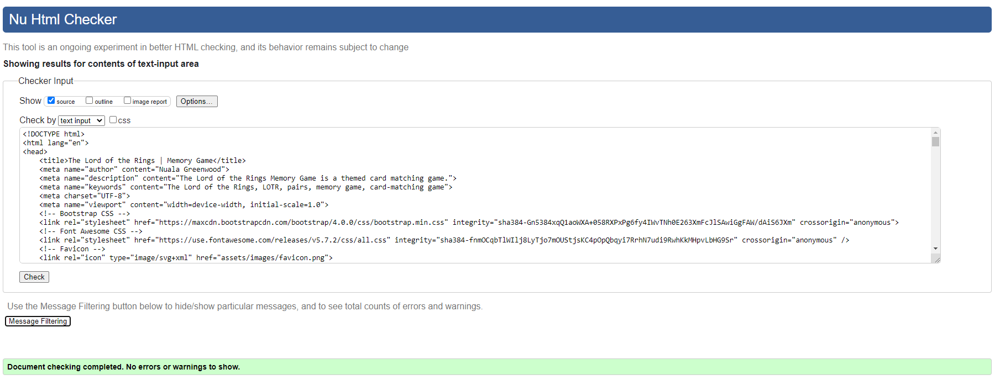
 

To check that the CSS file contained valid code it was inputted directly into the [W3C CSS Validation Service](https://jigsaw.w3.org/css-validator/).  
The style.css file returned no errors.

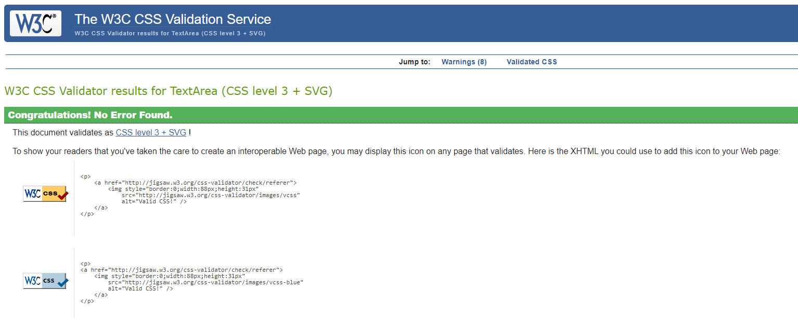
 

To test the validity of the JavaScript [Espirima](https://esprima.org/demo/validate.html) was used to check for syntactical errors.

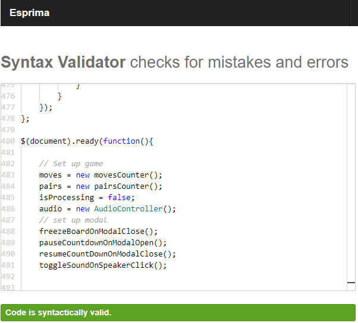
 

The JavaScipt file was also passed into [JSHint](jshint.com).  This highlighted many errors and warnings, predominantly relating to variables that had been declared
incorrectly with regard to the keywords 'let' and 'var'.  These errors have since been rectified.  
A StackOverflow suggestion of declaring /*globals $:false */ at the start of the file 
removed the warnings regarding the jQuery dollar sign without replacing every dollar sign with 'jquery'.  
The remaining so-called 'unused variable' is the startGame function which is called in the 'index.html' file in the opening modal. 
No other errors or warnings remain in the code.

 

### Performance
Once completed the website was tested using the Google Chrome Developer Tools Lighthouse test. Initially the site received a 75% rating on performance, 
largely due to the size of the images.

 
The images were then compressed using an online image compressor site, [Optimizilla](https://imagecompressor.com) and the new smaller images were then uploaded to the site. 
The subsequent test results showed marked improvement.

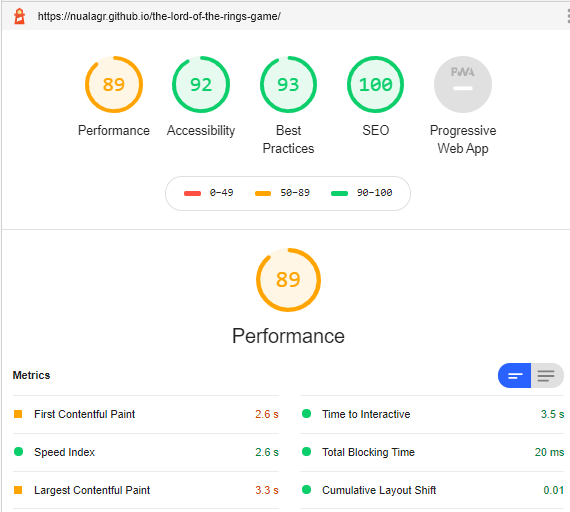
 

The site performed well when tested for desktop viewing.
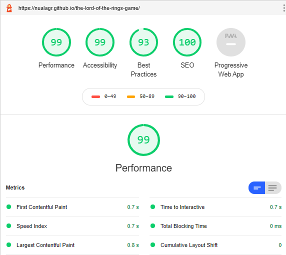
 

##### back to [top](#table-of-contents)
---

### Responsiveness
Web developer tools in each of the following browsers were used to ensure responsiveness and functionality of the site:

- Google Chrome
- Microsoft Edge
- Microsoft Opera
- Mozilla Firefox

Each website feature including, but not exclusive to, modals, buttons, game responses, mute, external links, hover effects etc. were manually checked within the 
aforementioned browsers.

Within each browser the site was checked for responsiveness and functionality when viewed on the following: 

**Mobile Devices**
- Android 7.0
- Galaxy S5
- Galaxy S9
- iPhone 5/SE
- iPhone 6/7/8
- iPhone 6/7/8 plus
- iPhone X / XS
- Moto G4
- Pixel 2
- Pixel 2XL
- Surface Duo

**Tablet Devices**
- iPad
- iPad Pro
- Kindle Fire HDX

**Laptop dimensions:**

- 15" Laptop (1024 x 800)
- 13" Laptop (1024 x 800)

**Desktop dimensions:**

- 24" Desktop (1920 x 1200)
- 22" Desktop (1680 x 1050)
- 20" Desktop (1600 x 900)

In addition to checking the game's functionality using browser developer tools, 
the site has been manually checked by friends and family.  In-game errors were highlighted 
during this process, such as the Game Over Modal displaying if the user exited the Prize Modal
using the Close button as opposed to the Restart button.  Issues highlighted have been recitified as far as was feasible.

##### back to [top](#table-of-contents)
---

### Tested User Stories

#### New User

As a new user I can:

&#9745; play a card-matching game presented in a visually appealing format.
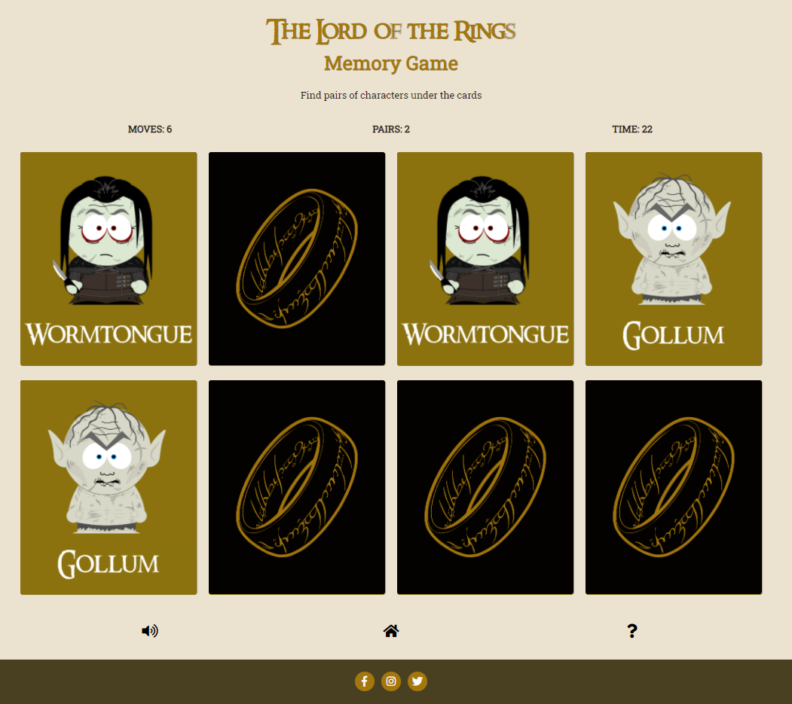

 
&#9745;  play a game which increases in complexity/challenge.

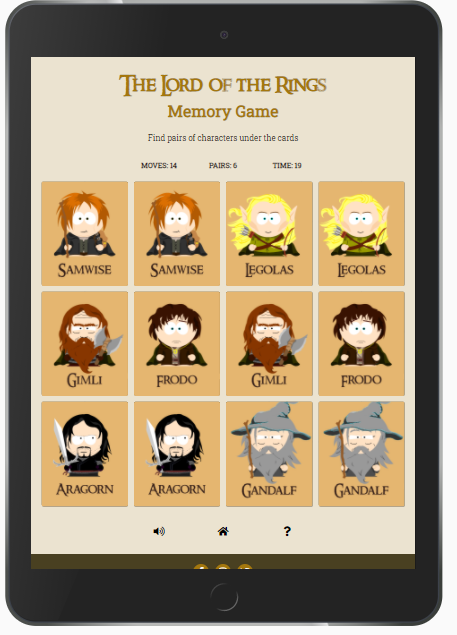

 
&#9745; read the rules of the game.

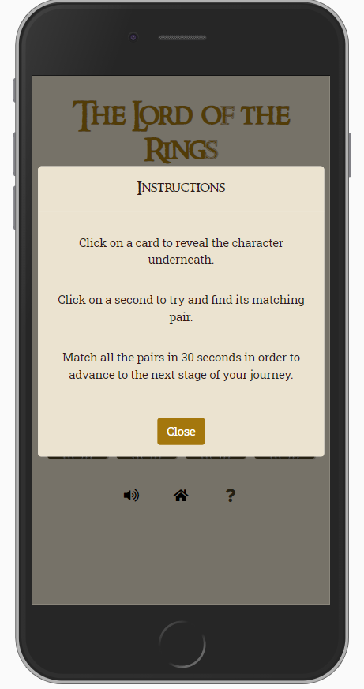

 

&#9745; navigate through the site with ease.
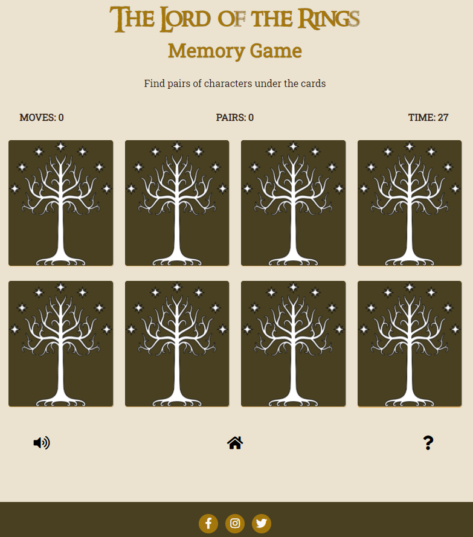

 

&#9745; modify settings to suit my game-play requirements with regard to 
  - whether to play in-game audio
  - whether to play with the Fellowship Card Pack or the Mordor Card Pack.
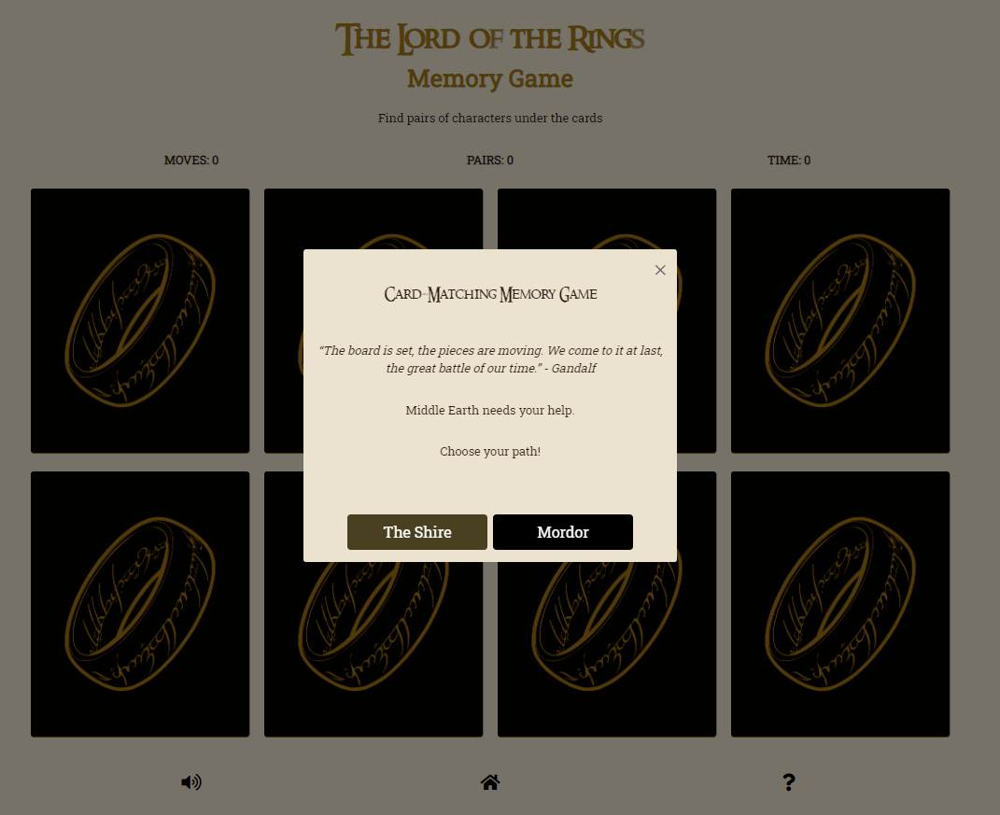

 

&#9745; receive regular, up-to-date feedback about how I am progressing in the game.
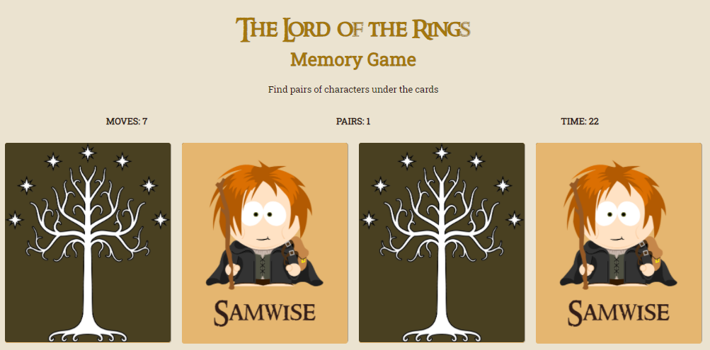

 

&#9745; enjoy the experience of playing the game.

&#9745; receive a visual reward for completing the game.
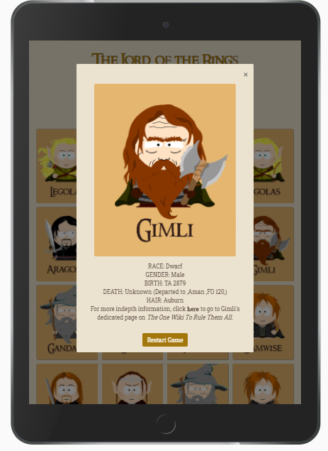

 

&#9745; learn some interesting facts about The Lord of the Rings characters.

&#9745; read some interesting quotes by the different Lord of the Rings characters.
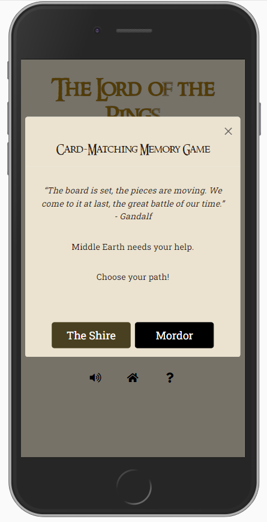

 

&#9745; improve my cognitive function.

&#9745; improve my reaction times.

 

#### General User

As a returning user I am able to:

&#9745; play a simple card-matching game presented in a visually appealing format.

&#9745; play a game which increases in complexity/challenge.

&#9745; receive different visual rewards for completing the game on subsequent attempts.

&#9745; view and match themed images of The Lord of the Rings characters.

&#9745; navigate through the site with ease.

&#9745; modify settings to suit my game-play requirements with regard to 
  - whether I want in-game sound effect
  - whether I want to play with the Fellowship Card Pack or the Mordor Card Pack.

&#9745; receive regular, up-to-date feedback about how I am progressing in the game.

&#9745; enjoy the experience of playing the game.

&#9745; be exposed to interesting facts about The Lord of the Rings characters.

&#9745; read some interesting quotes by The Lord of the Rings characters.

&#9745; improve my cognitive function.

&#9745; improve my reaction times.

 

#### The Lord of the Rings Fan

As a Lord of the Rings fan I am able to:

&#9745; view and match themed images of The Lord of the Rings characters.

&#9745; enjoy the experience of playing the game.

&#9745; receive a visual reward for completing the game.

&#9745; be exposed to interesting facts about different Lord of the Rings characters.

&#9745; read some interesting quotes by The Lord of the Rings characters.

 

#### Site Owner
As the owner of The Lord of the Rings Memory Game site I am able to:

&#9745; enjoy the experience of playing the game myself.

&#9745; provide site users with an enjoyable playing experience.

&#9745; provide site users with a visually appealing game. 

&#9745; provide site users with a game that is intuitive to play.

&#9745; provide site users with a game which increases in difficulty.

&#9745; provide new users with game rules that are concise and easy to read. 

&#9745; provide site users with a website that is easy to navigate.

&#9745; provide site users with the ability to tailor their game experience by including the ability to turn the audio component off if desired
and to choose to play with either the Fellowship Card Pack or the Mordor Card Pack. 

&#9745; expose site users to interesting facts and quotes from The Lord of the Rings 
books with a view to sharing my love of the Trilogy and instilling a curiosity in those who 
have not yet read the books. 

&#9745; provide users with links to other websites, social media sites and *The One Wiki to Rule them All* where they can access further information
about *The Lord of the Rings* trilogy and connect with other fans of the books and films.

 

##### back to [top](#table-of-contents)
---

### Bugs
Upon first loading the site when the user chose the Mordor pack the character images could often be seen before the card back images are written to screen.
This was not an issue in subsequent rounds after the card-back-image had been cached.
The images were compressed to decrease the page load time but this failed to solve the problem. My mentor helpfully suggested applying the jQuery .hide() method 
to hide the back of the card during this loading stage. This was applied. Although the card-back images are still slow to load the user can no longer 
see the front of card images before the game begins.

A significant issue during development regarded the cards that had been selected, clicked and revealed, but had no yet been successfully matched. 
At first jQuery's off() method was applied to the cards, however this removed the event handler and replacing it each time a card was clicked was unwieldy. 
A solution was found on [StackOverflow](https://stackoverflow.com/questions/56283681/js-memory-card-game-how-to-prevent-user-flipping-more-then-2-cards-at-the-same). 
An *if* statement was used to check the Boolean value of *isProcessing* and if true, to *return*, stopping any further processes from happening. 
An *or* operator and a further statement checking whether the class of 'face-up' had been applied to the same div was later added to the *if* statement in order to 
solve the problem of the 'card-flip' sound playing even though the card was in a face-up position.

#### Remaining Issues
The remaining issues regard the playing of in-game sound effects.  
When two cards are matched, the 'cards-match.mp3' sound plays before the second 'card-flip.mp3' sound.  
Similarly, the second card 'card-flip.mp3' sound will not play if the user clicks on card 2 too quickly after card 1 
and the first sound has not yet finished playing.  A delay using the *setTimeout* function was implemented however this 
did not solve the issue of the overlapping sound and degraded the performance of the game.  As the inclusion of in-game sound
effects greatly enhances the playing experience as well as providing auditory feedback to the user the sound effects were not
removed from the game despite this issue.  It is envisaged that this issue may be resolved given more time to investigate the use
of channels and/or a JavaScript audio library.

##### back to [top](#table-of-contents)
---

## Deployment

This project is hosted on [GitHub Pages](https://pages.github.com/)

### Deployment Procedure Followed:

1) When logged in to the [Github](https://github.com/) website the *The Lord of the Rings Memory Game* repository was selected from the repositories list in the top left-hand corner of the screen.

2) When in the selected respository, **Settings** was chosen from the navigation bar below the repository title.
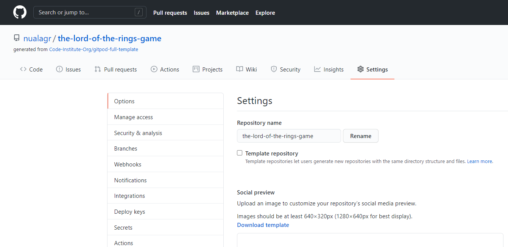

 

3) Scrolling down the **Settings** page revealed the **GitHub Pages** heading.  Under the **Source** subheading, the dropdown menu, whose default value is 'None', was clicked.  'Master' was selected from the dropdown list.
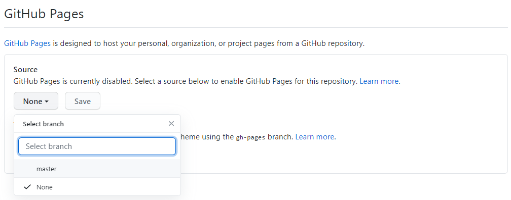

 

4) The **Save** button to the right of the newly selected 'Branch: master' was then clicked to deploy the site.

 

### To find the link to the newly deployed site:

1) Log in to [Github](https://github.com/) and navigate to the repository.

2) Under the heading **Environments**, in the navigation pane on the right of the screen, click on the 'github-pages' link.

 

3) **Deployments/Activity Log**: 
Clicking on the 'View deployment' button to the right of the screen will open the website in a separate browser window.
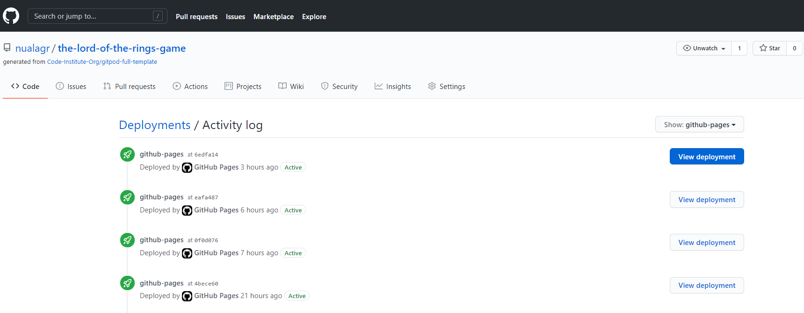

 
 

### To clone the repository:

1) Log in to [Github](https://github.com/).

2) Navigate to the main page of the repository.

3) Select the **Code** button from the navigation bar, located above the repository files.

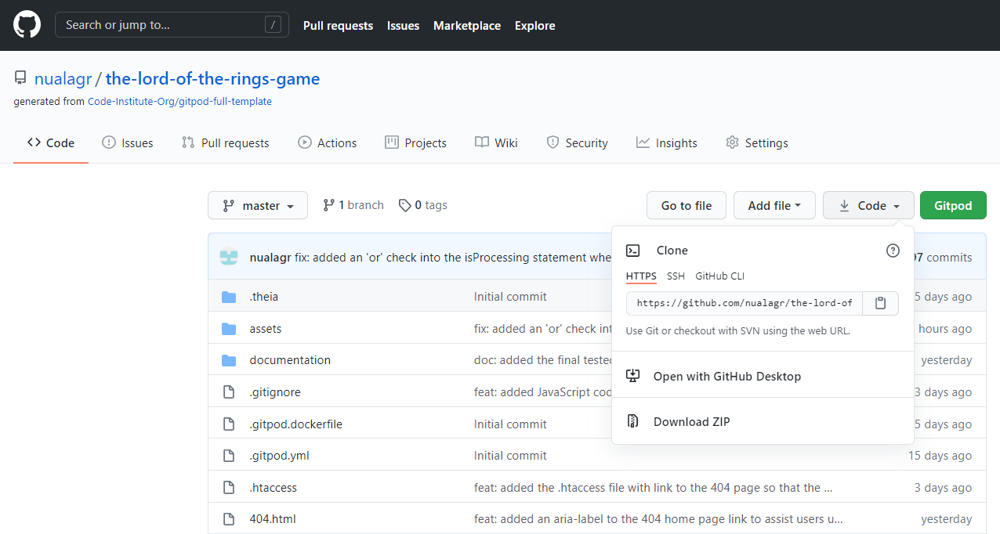

 

4) Under the heading **Clone** select 'HTTPS'

5) Copy the address by clicking on the image of a clipboard to the right of the URL. 

6) Open your local IDE (Integrated Development Environment).

7) Navigate to the directory where you want to create the cloned directory.

8) Type git clone, space, and then paste in the copied URL.  

9) Press 'Enter' to create the clone.

##### back to [top](#table-of-contents)
---

## Credits
### Content
The [Boostrap Modal component](https://getbootstrap.com/docs/4.0/components/modal/) was used and modified for each of the modals on the site.

### Media

### Images
- Grey forest and mountain from [Vecteezy](https://www.vecteezy.com/vector-art/229817-vector-beautiful-landscape-illustration) was used for the 404.html page background.
- White Tree of Gondor [Vectorstock](https://www.vectorstock.com/royalty-free-vector/white-tree-gondor-isolated-black-and-white-eps-vector-27150646) was used for the back of the Fellowship playing cards.
- The character images on each of the playing cards were created using [SP-Studio](https://www.sp-studio.de/).
 

### Sounds
- Game Monopoly game card pack place down on playing board 2, used for unmatched cards turning from [ZapSplat](https://www.zapsplat.com/page/3/?s=playing+card&post_type=music&sound-effect-category-id).
- Playing card on top of deck turn over, used for card flipping sound [ZapSplat](https://www.zapsplat.com/page/4/?s=playing+card&post_type=music&sound-effect-category-id).
- Multimedia alert bell chime notification metallic high pitched sound, used to indicate that cards have been matched, from [ZapSplat](https://www.zapsplat.com/music/bell-chime-notification-high-pitched-metallic-good-for-apps-games-and-other-ui-3/)
- Cartoon success fanfare, used for Congratulations Modal opening from [ZapSplat](https://www.zapsplat.com/?s=success&post_type=music&sound-effect-category-id=).
- Cartoon musical accent clarinet oboe fail descending, used for Game Over Modal [ZapSplat](https://www.zapsplat.com/?s=failure&post_type=music&sound-effect-category-id=).
- Multimedia game musical success complete orchestral horns 001, used for Advance Level Modals [ZapSplat](https://www.zapsplat.com/my_list/milikansama-list-1594971790/).
##### back to [top](#table-of-contents)
---

### Acknowledgements
- [Code Institue](https://codeinstitute.net/) and the very helpful tutors.
- Thank you to my project mentor [Reuben Ferrante](https://uk.linkedin.com/in/reuben-ferrante) for his wisdom and guidance during the project. 
- The [Code Institue](https://codeinstitute.net/) community on [Slack](code-institute-room.slack.com) for their support.
- A special thank you to my partner Kevin for his patience and support throughout this project. 
- I received inspiration for this project from:
  - https://zahur76.github.io/MilestoneProject2/
  - https://nickbell123.github.io/Marvel-Memory-Game/
  - [8-bitEarth](https://www.deviantart.com/8-bitearth/art/The-Lord-of-the-Rings-South-Park-version-363629107)'s Lord of the Rings character images created using [SP-Studio](https://www.sp-studio.de/).

 

##### back to [top](#table-of-contents)
---
